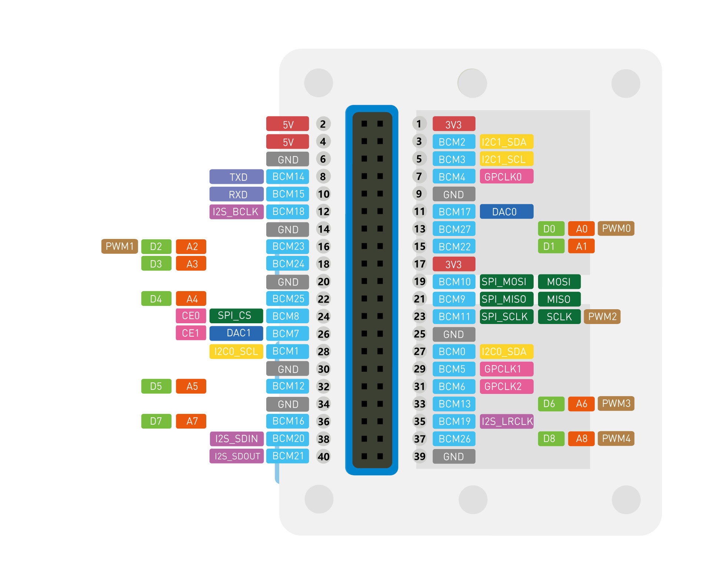

# SAMD_Micropython

## A collection of tools, board definition, custom code etc for MicroPython, focusing on SAMD51 MCUs, especially Wio Terminal.

### Board Definitions

There's only one board definition, for SeeedStudio's Wio Terminal, and I'll add more if and when I experiment with a new (to me) board. But the main reason for me to work on SAMD51 is the Wio Terminal. The board definition already existed, but I am adding to it – especially the `pins.csv` file – if you look at the pin names/numbers and the pinout below, nothing matches. There's NO `BCMxx` nomenclature. I am adding them, slowly, to the pins file, based on the pinout chart and the `variant.cpp` and `variant.h` files from the Arduino BSP package.

### Builds

I have compiled µP for the Wio Terminal. The build includes my custom code.

### Custom code

The `kongduino` module has a few functions, mostly AES-related, same as in [STM32_MicroPython](https://github.com/Kongduino/STM32_MicroPython). You need to add one line in `Makefile` around line 100, to include `kongduino.c` in the compilation process. You also need to check the `mpconfigboard.h` file for an additional define, which adds the SAMD51-specific hardware AES functions: `#define SAMD51_HARDWARE_AES (1)`.

Included commands so far:

* `crc(buffer)`: Calculates the CRC32 of a buffer. Original code by Michael Barr. I cut it down to just the CRC32. The idea is to have useful functions without too much overhead.
* `hexdump(buffer)`: My favorite function to show data that may not be ASCII.
* `reverse_array(buffer)`: does exactly what it says. Not *very* useful but I wrote that function when I started learning about custom C modules for µP.
* `[de|en]cryptAES_[ECB|CBC](source, key[, Iv])`: AES encryption / decryption, ECB and CBC, of a buffer whose length is a multiple of 16. I will add padding later. For the moment, DIY.

### SAMD51-specific hardware AES

* `[de|en]cryptAES_CBC_hw(source, key, Iv)`: hardware AES encryption / decryption, CBC only, of a buffer whose length is a multiple of 16. I will add padding later. For the moment, DIY.
* `hw_trng(buffer)`: fills up a buffer with random bytes.
* `hw_sha256(source, hash)`: hardware sha256 of a buffer whose length is a multiple of 64, into a buffer of length 32.

*Scripts*

* `test_aes.py`: a demonstration of the aes functions, software and hardware, plus CRC and sha256.
* `test_lzw.py`: a demonstration of the `lzw.py` library.
* `lzw.py`: a cut-down implementation of LZW specifically for ASCII (0-127). You can put it in `lib/micropython-lib/python-stdlib` so that it is included in the firmware, and compiled as `lzw.mpy`.
* `test_sha256.py`: test of the hardware sha256 function.
* `test_sx1276.py`: a script to test the `sx127x.py` library. The script works on any machine that has an SX1276 connected to it – you just need to set the pins properly. This is set up for a Nucleo-L476RG.
* `sx127x.py`: the library. There are several version floating around, and most have issues. I have fixed most of them, and added features like TRNG. It'll do nicely until I write a library in C.

### Tools

* `calculate_crc_table.c`: In the `crc.c` file, there's a function to compute the CRC table. I printed it out and initialize it at compile time, to save space, and improve speed.
* `ziphex.sh`: a bash script to zip the .hex builds, before pushing to GitHub.

## TODO

I plan to add a lightweight LoRa library for sx1276. No plans for LoRaWAN, or sx1262 for now. We'll see...